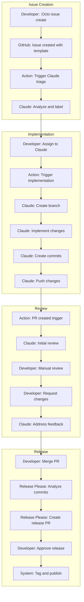

I am exploring technical entrepreneurship as a practice. And here is my sacred cognitive tehnologies.

The user wants a more technical, precise document that serves as a handoff to a software expert LLM orchestrator. Less philosophy, more specific technical details about:
- Specific Neovim extensions and their configurations
- Classical coding best practices for issues and PR structure
- Claude-specific features we analyzed
- Technical implementation details

I need to rewrite this to be much more concrete and implementation-focused, with specific commands, configurations, and technical workflows.

# GitHub-Native Development Workflow: Technical Architecture and Implementation Guide

## System Overview and Technical Components

This document provides a comprehensive technical specification for implementing a GitHub-native development workflow that integrates AI agents through terminal-based orchestration. The system combines specific Neovim plugins, GitHub Actions workflows, and Claude AI capabilities to create an automated development pipeline.

The architecture consists of precisely configured components that communicate through well-defined interfaces. Each component serves a specific technical function within the larger system, with clear data flows and interaction patterns that enable both human developers and AI agents to collaborate effectively.

## Core Technical Stack

### Neovim Plugin Architecture

The Neovim configuration forms the primary user interface layer, utilizing specific plugins that provide GitHub integration and Git workflow management. The following plugins constitute the core development environment:

**Octo.nvim** serves as the GitHub API client within Neovim, providing comprehensive issue and pull request management capabilities. The plugin exposes commands including `:Octo issue create`, `:Octo issue list`, `:Octo pr create`, and `:Octo pr checkout`. Configuration requires GitHub CLI authentication and supports custom keybindings for common operations.

**Neogit** provides the Git interface, implementing a Magit-style workflow with staging, committing, and branch management. Key features include interactive staging with granular hunk selection, commit message templates enforcing conventional commit format, and integration with git hooks for pre-commit validation. The plugin configuration includes custom commit template paths and integration with Diffview.nvim for enhanced diff visualization.

**Diffview.nvim** extends Git visualization capabilities, providing side-by-side diff views and commit history exploration. The plugin integrates with both Neogit and Octo.nvim, enabling developers to review changes before committing or during pull request reviews. Configuration includes custom keybindings and integration with the native Neovim diff mode.

**Gitsigns.nvim** provides inline Git status indicators and enables hunk-level operations directly in buffers. The plugin shows added, modified, and deleted lines in the sign column and provides commands for staging, resetting, and previewing hunks. This enables atomic commit creation by allowing developers to stage specific changes while reviewing code.

### GitHub Actions Workflow Architecture

The GitHub Actions infrastructure implements four primary workflow patterns that automate different aspects of the development cycle:

```yaml
# claude-pr-assistant.yml - AI Code Review and Implementation
name: Claude PR Assistant
on:
  issue_comment:
    types: [created]
  pull_request_review_comment:
    types: [created]
  issues:
    types: [opened, assigned]
  pull_request_review:
    types: [submitted]

jobs:
  claude-code-action:
    if: |
      (github.event_name == 'issue_comment' && contains(github.event.comment.body, '@claude')) ||
      (github.event_name == 'pull_request_review_comment' && contains(github.event.comment.body, '@claude')) ||
      (github.event_name == 'pull_request_review' && contains(github.event.review.body, '@claude')) ||
      (github.event_name == 'issues' && contains(github.event.issue.body, '@claude'))
    runs-on: ubuntu-latest
    permissions:
      contents: read
      pull-requests: read
      issues: read
      id-token: write
    steps:
      - uses: anthropics/claude-code-action@beta
        with:
          anthropic_api_key: ${{ secrets.ANTHROPIC_API_KEY }}
          allowed_tools: "Edit,Glob,Grep,LS,Read,Write,mcp__github_file_ops__commit_files"
          custom_instructions: |
            Follow the repository's CLAUDE.md for project-specific guidelines.
            Use conventional commit messages for all commits.
            Include appropriate tests with implementations.
```

The workflow triggers on specific GitHub events and uses OIDC authentication for secure token exchange. The `allowed_tools` parameter restricts Claude's capabilities to file operations and GitHub-specific actions, maintaining security while enabling productive assistance.

### Release Please Configuration

Release Please automates version management based on conventional commits, requiring specific configuration for optimal integration:

```yaml
# release-please.yml
name: Release Please
on:
  push:
    branches:
      - main
jobs:
  release:
    runs-on: ubuntu-latest
    steps:
      - uses: google-github-actions/release-please-action@v4
        with:
          release-type: node
          package-name: your-package
          token: ${{ secrets.GITHUB_TOKEN }}
          changelog-sections: |
            {"type":"feat","section":"Features","hidden":false},
            {"type":"fix","section":"Bug Fixes","hidden":false},
            {"type":"perf","section":"Performance Improvements","hidden":false},
            {"type":"docs","section":"Documentation","hidden":false}
```

The configuration maps conventional commit types to changelog sections, ensuring generated release notes provide clear categorization of changes. The workflow analyzes commit history since the last release and creates pull requests with updated version numbers and changelog entries.

## Conventional Commit Implementation

The system enforces conventional commits through multiple layers, ensuring consistency across human and AI-generated commits. The specification follows the Angular convention with specific type mappings:

- `feat`: New features trigger minor version bumps
- `fix`: Bug fixes trigger patch version bumps
- `docs`: Documentation changes trigger patch version bumps
- `style`: Code style changes trigger no version bump
- `refactor`: Code refactoring triggers patch version bumps
- `perf`: Performance improvements trigger patch version bumps
- `test`: Test additions/changes trigger no version bump
- `chore`: Maintenance tasks trigger no version bump

Breaking changes append `!` to the type or include `BREAKING CHANGE:` in the footer, triggering major version bumps regardless of type.

### Git Hook Implementation

The local commit-msg hook validates conventional commit format:

```bash
#!/bin/bash
# .git/hooks/commit-msg

commit_regex='^(feat|fix|docs|style|refactor|perf|test|chore)(\(.+\))?: .{1,50}'
breaking_regex='BREAKING CHANGE:'

if ! grep -qE "$commit_regex" "$1"; then
    echo "Invalid commit message format!"
    echo "Format: <type>(<scope>): <subject>"
    echo "Example: feat(auth): add OAuth2 support"
    exit 1
fi

# Check for breaking changes
if grep -q "$breaking_regex" "$1" || grep -qE "^[a-z]+(\(.+\))?!:" "$1"; then
    echo "Breaking change detected - major version bump will occur"
fi
```

This validation ensures commits follow the expected format before they enter the repository, maintaining consistency for downstream automation.

## Claude AI Integration Patterns

Claude operates through GitHub Actions with specific capabilities and constraints that shape integration patterns. The system uses Claude Code Action, which provides file system access and GitHub API operations within a sandboxed environment.

### Claude Capability Matrix

Claude can perform the following operations through the provided tools:
- Read and write files using the Edit, Read, and Write tools
- Search codebases using Glob and Grep tools
- List directory contents with LS tool
- Commit changes atomically using mcp__github_file_ops__commit_files
- Update its own comment to provide progress updates

Claude cannot perform these operations:
- Execute arbitrary shell commands without explicit permission
- Access external APIs beyond GitHub
- Modify GitHub Actions workflow files
- View CI/CD logs or test results directly
- Create new pull requests (can only push to existing branches)

### Issue Template Structure

Issues follow templates that provide context for both human developers and Claude:

```yaml
name: Feature Request
description: Propose a new feature
labels: ["enhancement"]
body:
  - type: markdown
    attributes:
      value: |
        ## Feature Description
        Provide a clear description of the feature
        
  - type: textarea
    id: problem
    attributes:
      label: Problem Statement
      description: What problem does this feature solve?
    validations:
      required: true
      
  - type: textarea
    id: solution
    attributes:
      label: Proposed Solution
      description: How should this feature work?
      
  - type: textarea
    id: acceptance
    attributes:
      label: Acceptance Criteria
      description: How do we know when this feature is complete?
      value: |
        - [ ] Criterion 1
        - [ ] Criterion 2
        
  - type: textarea
    id: context
    attributes:
      label: Technical Context
      description: Any technical details Claude should know?
```

This structure ensures Claude receives sufficient context to understand and implement features effectively.

### Pull Request Workflow Integration

Pull requests follow a structured template that facilitates both human and AI review:

```markdown
## Description
Brief description of changes

## Related Issue
Closes #123

## Type of Change
- [ ] Bug fix (non-breaking change fixing an issue)
- [ ] New feature (non-breaking change adding functionality)
- [ ] Breaking change (fix or feature causing existing functionality to change)

## Testing
- [ ] Unit tests pass locally
- [ ] Integration tests updated
- [ ] Manual testing completed

## Checklist
- [ ] Code follows project style guidelines
- [ ] Self-review completed
- [ ] Comments added for complex logic
- [ ] Documentation updated
- [ ] No new warnings generated
```

Claude analyzes this structure during reviews, checking that all sections are completed and that changes align with the stated type and related issue.

## Neovim Configuration Details

The Neovim setup requires specific configurations for optimal integration:

```lua
-- ~/.config/nvim/lua/plugins/github-workflow.lua

return {
  -- Octo.nvim configuration
  {
    'pwntester/octo.nvim',
    dependencies = {
      'nvim-lua/plenary.nvim',
      'nvim-telescope/telescope.nvim',
      'kyazdani42/nvim-web-devicons',
    },
    config = function()
      require('octo').setup({
        use_local_fs = false,
        enable_builtin = true,
        default_remote = {"upstream", "origin"},
        ssh_aliases = {},
        github_hostname = "",
        snippet_context_lines = 4,
        gh_env = {},
        timeout = 5000,
        ui = {
          use_signcolumn = true,
        },
        issues = {
          order_by = {
            field = "CREATED_AT",
            direction = "DESC"
          }
        },
        pull_requests = {
          order_by = {
            field = "UPDATED_AT",
            direction = "DESC"
          },
          always_select_remote_on_create = false
        },
        file_panel = {
          size = 10,
          use_icons = true
        }
      })
    end
  },

  -- Neogit configuration
  {
    'NeogitOrg/neogit',
    dependencies = {
      'nvim-lua/plenary.nvim',
      'sindrets/diffview.nvim',
    },
    config = function()
      require('neogit').setup({
        disable_signs = false,
        disable_hint = false,
        disable_context_highlighting = false,
        disable_commit_confirmation = false,
        auto_refresh = true,
        disable_builtin_notifications = false,
        use_magit_keybindings = false,
        commit_popup = {
          kind = "split",
        },
        integrations = {
          diffview = true
        },
        sections = {
          untracked = {
            folded = false
          },
          unstaged = {
            folded = false
          },
          staged = {
            folded = false
          },
          stashes = {
            folded = true
          },
          unpulled = {
            folded = true
          },
          unmerged = {
            folded = false
          },
          recent = {
            folded = true
          },
        },
      })
    end
  }
}
```

Key bindings for common operations:

```lua
-- GitHub workflow keybindings
vim.keymap.set('n', '<leader>gi', ':Octo issue list<CR>')
vim.keymap.set('n', '<leader>gI', ':Octo issue create<CR>')
vim.keymap.set('n', '<leader>gp', ':Octo pr list<CR>')
vim.keymap.set('n', '<leader>gP', ':Octo pr create<CR>')
vim.keymap.set('n', '<leader>gr', ':Octo review start<CR>')

-- Git workflow keybindings
vim.keymap.set('n', '<leader>gg', ':Neogit<CR>')
vim.keymap.set('n', '<leader>gc', ':Neogit commit<CR>')
vim.keymap.set('n', '<leader>gd', ':DiffviewOpen<CR>')
vim.keymap.set('n', '<leader>gh', ':DiffviewFileHistory<CR>')
```

## Branch Management Strategy

The system implements a structured branch naming convention that encodes semantic information:

```
<type>/<issue-number>-<description>

Examples:
feat/123-user-authentication
fix/456-memory-leak
docs/789-api-documentation
```

Branch creation follows this pattern through Neogit's branch creation command, with optional automation through a custom function:

```lua
-- Custom branch creation with issue integration
function CreateIssueBranch()
  local issue_number = vim.fn.input("Issue number: ")
  local branch_type = vim.fn.input("Type (feat/fix/docs): ")
  local description = vim.fn.input("Description: ")
  
  -- Convert description to kebab case
  description = description:gsub("%s+", "-"):lower()
  
  local branch_name = string.format("%s/%s-%s", branch_type, issue_number, description)
  vim.cmd("!git checkout -b " .. branch_name)
end
```

## MCP Server Architecture

The Model Context Protocol (MCP) servers provide Claude with extended capabilities. The GitHub file operations server implements atomic commits and comment updates:

```typescript
// github-file-ops-server.ts key functionality
server.tool(
  "commit_files",
  "Commit one or more files to a repository in a single commit",
  {
    files: z.array(z.string()).describe('Array of file paths'),
    message: z.string().describe('Commit message following conventional format'),
  },
  async ({ files, message }) => {
    // Implementation uses GitHub's Trees API for atomic commits
    // 1. Get current branch reference
    // 2. Create tree with all file changes
    // 3. Create commit pointing to new tree
    // 4. Update branch reference to new commit
  }
);
```

This atomic commit approach ensures that partial updates never occur, maintaining repository consistency even if operations fail mid-process.

## Data Flow Sequences

The complete data flow for issue-to-release follows a precise sequence of operations:



Each step involves specific API calls and state transitions that maintain consistency across the system.

## Error Handling and Recovery Procedures

The system implements multiple error handling strategies based on component failure modes:

**GitHub API Rate Limiting**: The system monitors rate limit headers and implements exponential backoff when approaching limits. Claude operations include retry logic with maximum attempt counts to prevent infinite loops.

**Claude API Failures**: When Claude fails to respond or returns errors, the workflow logs detailed error information and falls back to manual operation. Failed Claude comments include error details to aid debugging.

**Git Operation Failures**: Merge conflicts and push rejections trigger specific error messages with resolution instructions. The system preserves work in progress through careful branch management and atomic operations.

**Action Workflow Failures**: Each GitHub Action includes timeout configurations and failure notifications. Failed workflows can be re-run manually with additional debugging output enabled.

## Security Implementation

Security measures are implemented at multiple levels:

**Token Management**: GitHub tokens use minimum required scopes and rotate automatically through OIDC. Claude API keys are stored in GitHub Secrets with repository-level access controls.

**Branch Protection**: Main branches require pull request reviews and passing status checks. Direct pushes are disabled except for automated release commits from trusted workflows.

**Commit Signing**: GPG signing is encouraged for human commits, while automated commits include clear attribution through commit messages and author fields.

**Access Control**: Repository permissions follow the principle of least privilege. Claude operates with write permissions but cannot modify protected resources like workflow files.

## Performance Considerations

The system optimizes performance through several mechanisms:

**Shallow Clones**: GitHub Actions use shallow clones with appropriate depth for the operation type. PR reviews clone with depth 20 for context, while new branches use depth 1.

**Caching Strategies**: Dependencies are cached between workflow runs. Neovim plugin managers cache downloaded plugins and build artifacts.

**Parallel Operations**: Where possible, operations run in parallel. Multiple Claude reviews can process simultaneously on different PRs.

**Resource Limits**: Claude operations include token limits and timeout configurations to prevent runaway processes. Large repositories implement file filtering to focus Claude on relevant code sections.

This technical architecture provides a complete implementation blueprint for the GitHub-native development workflow, with specific configurations, code examples, and operational procedures that enable effective human-AI collaboration through terminal-based interfaces.
